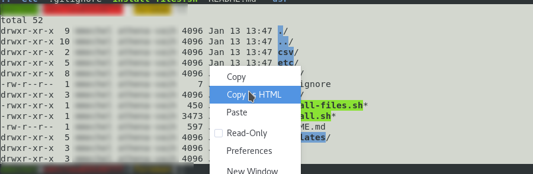
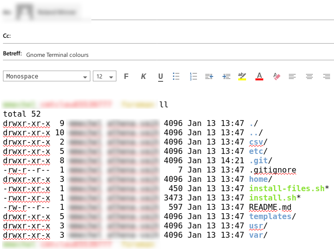

# Preserving colours when copying and pasting from Gnome Terminal

Sometimes it is very helpful to keep colours when pasting to a mail or document.
The easiest way is to do this via the Gnome Terminal's "Copy as HTML" function.

By default there is no shortcut set for this, but you can easily assign something like `CTRL+SHIFT+X` in the preferences.

This preserves colours and formatting when pasting to a mail.

